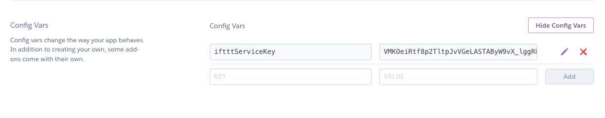

## Intro
This is a sample project based on the project sample service that IFTTT provides here: `https://platform.ifttt.com/docs/hello_world#hello-world`

That sample is a Ruby app which properly responds to a series of tests which are executed when you create a new IFTTT service.

This project is an analog of the Ruby sample written in Java and using Jersey. It can be deployed to Heroku as a free dyno. 

## How to use
An IFTTT service uses a `service key`. The service key is set under the `API` tab of your service. This key is used to authenticate the service calls from IFTTT to your service (this app). As such, you need to include the key during the start-up. 

### Local/Dev/Test
If you are running this locally do the following: 
* Navigate to the root of this project
* Execute the following `mvn clean package jetty:run -DskipTests=true -DiftttServiceKey=ENTER YOUR KEY HERE`

The service will be available under port `8080` and you can check its status here: 
`curl --header "Ifttt-Service-Key: ENTER YOUR KEY HERE" localhost:8080/ifttt/v1/status`

You'll get this if your service is up and you sent the correct : 
`{"status_code":200,"status_msg":"Welcome to IFTTT Service. If you see this, the application is up and running"}`

### Heroku Deployment
You can deploy this to Heroku using the free dynos option they have. The service requires the IFTTT service key to be included the deployment. The key can be added to the dyno under `settings` tab of your application under `config vars`

You can check the status of the deployment here (the port is not needed): 
`curl --header "Ifttt-Service-Key: ENTER YOUR KEY HERE" https://<name of your app>.herokuapp.com/ifttt/v1/status`

You'll get this if your service is up and you sent the correct : 
`{"status_code":200,"status_msg":"Welcome to IFTTT Service. If you see this, the application is up and running"}`

### Troubleshooting
* Non 200s
   * If you do not use the correct request method (GET vs POST) you'll get an error. 
   * If you do not send the correct service key in the header you'll get a 401 response. The same will happen if you do not send the header itself.

* Service does not start
   * The service will exit if it cannot find the service key. The service key must be included either as a `-D` parameter or an environment variable. The service key must be named `iftttServiceKey`

## Contributing
See more [information here](./CONTRIBUTING.md)

